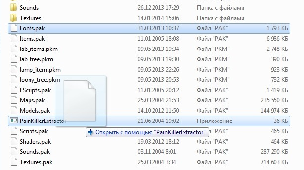

## PainKillerExtractor (PainKiller Game Resource Extractor)

Painkiller (2004) PAK file extractor by Andrew Frolov

http://pkrc.ru/load/painkiller/programmy/raspakovshhik_pak_fajlov/28-1-0-95

It is a small `.exe` binary along with the source code to build it.

### How to use

Create a shortcut, open its "Properties", and in the "Object" field add a space and write the name of the pack you need, for example: `"D:\Painkiller\Data\PainKillerExtractor.exe Textures1.pak"`. Note that the program itself (only `.exe` file) should be present and run in the same folder as the archives. A folder with the name of the pack is created after unpacking but there will be an exclamation mark at the beginning of the unpacked folder/file name (for example, `!Textures1.pak`).

#### Alternative way to unpack

You can simply drag and drop the `.pak` archive to this application (drag the `.pak` archive with the mouse cursor to the `.exe` file).

## To use the edited file back in the game

There will be a folder after unpacking (for example, `!LScripts.pak`). We find and edit the desired file in this folder, then delete all unnecessary folders and files that have not been edited and we put this very folder (in my case, `!LScripts.pak`) into the `Data` folder, having previously removed `!` (exclamation mark) from its name and the `.pak` extension with a dot.
The changes will take effect on the next level.

## Issues

This tool is not suitable for level archives and system scripts. It may not correctly unpack some files.

Alternatively, use [Painfull Extractor]( http://pkrc.ru/load/painkiller/programmy/painfull_extractor_raspakovshhik_pak_fajlov/28-1-0-124) or [Dragon UnPACKer](https://www.elberethzone.net/dragon-unpacker.html).
