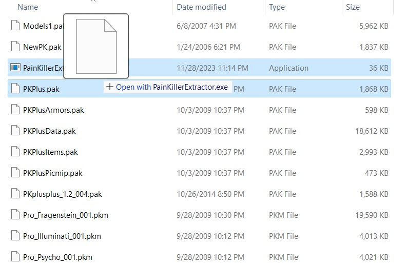

## PainKillerExtractor (PainKiller Game Resource Extractor)

Painkiller (2004) PAK file extractor by Andrew Frolov

http://pkrc.ru/load/painkiller/programmy/raspakovshhik_pak_fajlov/28-1-0-95

It is a small `.exe` binary along with the source code to build it.

### How to use

> Be sure to place `PainKillerExtractor.exe` with the file you want to extract in a separate folder so that the extraction will not mess the files in your current folder.

* Unpacking by drag-and-drop

    You can simply drag and drop the **.pak** or **.pkm** archive to this application (drag the .pak archive with the mouse cursor to the .exe file) and it will unpack the resources automatically.

    

* Unpacking via CLI

    ```psh
    .\PainKillerExtractor.exe PKPlus.pak
    ```

## Issues

This tool is not suitable for level archives and system scripts. It may not correctly unpack some files.

Alternatively, use [Painfull Extractor]( http://pkrc.ru/load/painkiller/programmy/painfull_extractor_raspakovshhik_pak_fajlov/28-1-0-124) or [Dragon UnPACKer](https://www.elberethzone.net/dragon-unpacker.html).
